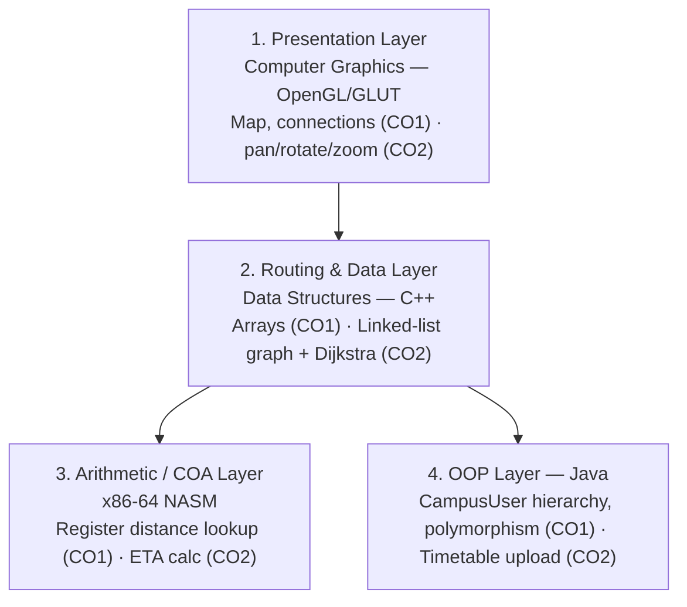

# Smart Campus Navigator

An integrated campus navigation system that locates buildings, floors and rooms, looks up faculty availability, and finds the shortest walking route between any two points on campus — built as a four-subject academic integration project (CO1 + CO2).

> **Status:** CO1 + CO2 completed. Developed for MIT Academy of Engineering (MITAOE), Second Year B.Tech (Software Engineering).

---

## Table of Contents

- [Overview](#overview)
- [Features](#features)
- [Tech Stack](#tech-stack)
- [Architecture](#architecture)
- [Project Structure](#project-structure)
- [Team & Contributions](#team--contributions)
- [Subject-wise Implementation](#subject-wise-implementation)
- [CO Achievement Summary](#co-achievement-summary)
- [Getting Started](#getting-started)
- [AI Usage Disclosure](#ai-usage-disclosure)
- [Results](#results)

---

## Overview

Smart Campus Navigator combines four academic subjects into one functional system instead of four unrelated lab submissions. Each subject owns a concrete responsibility within the shared project:

| Subject | Technology | Main Responsibility |
|---|---|---|
| Computer Graphics (CG) | C++ / OpenGL / GLUT | Rendering the campus map and visual presentation |
| Data Structures (DS) | C++ | Building/room/faculty lookup and shortest-route graph |
| Computer Organization & Architecture (COA) | x86-64 NASM Assembly | Register-level distance lookup and ETA arithmetic |
| Problem Solving using OOP (PSOOP) | Java | OOP campus-user model + timetable-upload module |

## Features

- 🗺️ Interactive 2D top-down campus map (buildings, rooms, gate, staircases, connections)
- 🔍 Search buildings, rooms and faculty by name
- 🧭 Shortest-route computation between any two campus locations (Dijkstra)
- 👩‍🏫 Faculty-route search — find directions to a professor's office for a given time slot
- 🖱️ Real-time pan / rotate / zoom of the campus map
- ⏱️ Route-distance and ETA calculation implemented at the assembly/register level
- 📄 "My Timetable" — upload a personal timetable (PDF) via a lightweight Java web page

## Tech Stack

- **Data Structures:** C++ (arrays, linked lists, Dijkstra's algorithm)
- **COA:** x86-64 NASM assembly, Linux syscalls
- **Computer Graphics:** OpenGL + GLUT
- **PSOOP:** Java (`com.sun.net.httpserver`, OOP: abstract classes, inheritance, polymorphism, interfaces, lambdas)

## Architecture

The system is represented as four technical layers, each mapping one subject's CO1 + CO2 work to a concrete responsibility:

```
┌───────────────────────────────────────────────────────────────┐
│                      1. PRESENTATION LAYER                     │
│                Computer Graphics — OpenGL / GLUT                │
│   Static campus map: buildings, rooms, gate, connections (CO1) │
│      Pan / rotate / zoom + faculty overlay panel (CO2)         │
└──────────────────────────────┬──────────────────────────────────┘
                                │
                                ▼
┌───────────────────────────────────────────────────────────────┐
│                    2. ROUTING & DATA LAYER                     │
│                     Data Structures — C++                       │
│   Arrays: buildings / floors / rooms / faculty directory (CO1) │
│   Linked-list graph + Dijkstra route + faculty search (CO2)    │
└───────────────────┬─────────────────────────┬────────────────────┘
                     │                         │
                     ▼                         ▼
┌────────────────────────────────┐ ┌─────────────────────────────────┐
│   3. ARITHMETIC / COA LAYER     │ │       4. OOP LAYER — Java        │
│    Assembly — x86-64 NASM       │ │  CampusUser (abstract) → Student,│
│  FROM/TO held in CPU registers  │ │  Faculty; polymorphic navigate() │
│  cmp/je distance lookup (CO1)   │ │  interface + lambda search (CO1) │
│  ETA = distance / 80, div (CO2) │ │  My Timetable upload over        │
│                                  │ │  HttpServer, static/final (CO2)  │
└────────────────────────────────┘ └─────────────────────────────────┘
```

<details>
<summary>Mermaid version (renders automatically on GitHub)</summary>



</details>

**Architecture principle:** each subject contributes a meaningful technical component rather than existing as an unrelated practical submission — CO1 builds the static foundation of each layer, CO2 adds the dynamic/interactive behavior on top of it.

## Project Structure

```
smart-campus-navigator/
├── DS/                     # Data Structures (C++)
│   ├── arrays.cpp          # CO1: buildings/floors/rooms + faculty arrays
│   └── graph_dijkstra.cpp  # CO2: linked-list graph + Dijkstra routing
├── COA/                    # Computer Organization & Architecture (NASM)
│   └── route_eta.asm       # CO1 register lookup + CO2 ETA calculation
├── CG/                     # Computer Graphics (OpenGL/GLUT)
│   ├── campus_map_co1.cpp  # CO1: static primitives
│   └── campus_map_co2.cpp  # CO2: geometric transformations
├── PSOOP/                  # Java
│   ├── CampusUser.java     # Abstract base class
│   ├── Student.java        # Extends CampusUser
│   ├── Faculty.java        # Extends CampusUser
│   ├── TimetablePage.java  # My Timetable upload page (HTML)
│   └── Main.java           # HttpServer bootstrap
└── README.md
```

*(Adjust filenames/paths above to match your actual repo layout.)*

## Team & Contributions

Every member contributed across all four subjects rather than owning a single one:

| Student | PRN | DS (C++) | COA (Assembly) | CG (OpenGL) | PSOOP (Java) |
|---|---|---|---|---|---|
| Aarya | 202501100163 | Arrays, building/room data, search & update | Menu display + reading FROM/TO input (CO1) | `glTranslatef()` — moving the campus map | Abstract class, inheritance & `super` — common campus-user structure |
| Vaishnavi | 202501100162 | Faculty data — search, insert, update & delete | Location validation + register-based distance lookup (CO1) | `glScalef()` — zoom in/out | Polymorphism — different `navigate()` behavior for Student/Faculty |
| Shreya | 202501100190 | Linked-list graph, nodes, edges & connections | ETA calculation: `distance / 80` via `div` (CO2) | `glRotatef()` — map orientation | Interface + lambda expressions — location search |
| Ricky | 202602100020 | BFS, queue, route finding, integration & testing | `print_number` routine, syscall I/O, NASM testing (CO2) | Integrated all CO2 transformations + keyboard controls & reset | Static & final — combines all members' work, final CO2 testing |

## Subject-wise Implementation

### Data Structures (DS) — CO1 & CO2
- **CO1 — Arrays:** Static location data via `buildings[4]`, `floors[4][3]`, `rooms[4][3][5]`, plus a faculty directory. Operations: view buildings/rooms, search room, search faculty, view all faculty.
- **CO2 — Linked List:** Campus connectivity as a graph built from linked lists — each `Node` owns a linked list of `Edge` records (its adjacency list) storing distance in metres, covering the gate, 4 blocks, 60 rooms and staircases. Dijkstra's algorithm computes shortest routes; a faculty-route feature routes to a professor's room for a given time slot.

### Computer Organization & Architecture (COA) — CO1 & CO2
Written directly in x86-64 NASM assembly.
- **CO1:** FROM/TO location codes held in registers (`r12d`/`r13d`); cascading `cmp`/`je`/`jne` comparisons look up the distance into `eax` → `r14d`.
- **CO2:** ETA = `⌈distance / 80⌉` minutes via `add`/`div`, displayed with a hand-written `print_number` routine. I/O uses raw Linux syscalls — no C library.

### Computer Graphics (CG) — CO1 & CO2
- **CO1 — Primitives:** Full 2D campus map using `GL_QUADS` (rooms/buildings/gate), `GL_LINE_LOOP` (borders), `GL_LINES` (connections), `GL_TRIANGLES` (arrowheads), `GL_POINTS` (building nodes).
- **CO2 — Transformations:** `glTranslatef` / `glRotatef` / `glScalef` driven by keyboard (arrow keys pan, +/- scale, A/D rotate, R resets), plus an on-screen faculty panel.

### PSOOP — Java — CO1 & CO2
- **CO1 — OOP model:** `CampusUser` abstract base class with `Student`/`Faculty` subclasses (inheritance, `super`), polymorphic `navigate()`, and an interface + lambda expressions for location search.
- **CO2 — My Timetable:** `TimetablePage` (HTML upload-card page) + `Main` (Java `HttpServer` on port 8080) let a student upload their timetable as a PDF; `static`/`final` members tie the module together, using the built-in HTTP server instead of an external framework to keep the feature lightweight.

## CO Achievement Summary

| Objective | Subject | Implementation | Result |
|---|---|---|---|
| Static location lookup | DS (CO1) | Arrays for buildings/rooms/faculty | ✅ Achieved |
| Shortest-route computation | DS (CO2) | Linked-list graph + Dijkstra | ✅ Achieved |
| Register-level route lookup | COA (CO1) | `cmp`/`je` distance lookup via registers | ✅ Achieved |
| Assembly-level arithmetic | COA (CO2) | ETA calculation with `div`, raw syscalls | ✅ Achieved |
| 2D graphics primitives | CG (CO1) | `GL_QUADS`/`GL_LINES`/`GL_TRIANGLES` map | ✅ Achieved |
| Real-time transformations | CG (CO2) | Keyboard-driven pan/rotate/scale | ✅ Achieved |
| OOP real-world solution | PSOOP (CO1) | `CampusUser` hierarchy, polymorphism, interfaces | ✅ Achieved |
| Reduced-complexity design | PSOOP (CO2) | Built-in `HttpServer`, single-responsibility classes | ✅ Achieved |
| Four-subject integration | All | Shared campus data model across all layers | ✅ Achieved |

## Getting Started

### Data Structures (C++)
```bash
g++ DS/arrays.cpp DS/graph_dijkstra.cpp -o navigator_ds
./navigator_ds
```

### COA (NASM, Linux)
```bash
nasm -f elf64 COA/route_eta.asm -o route_eta.o
ld route_eta.o -o route_eta
./route_eta
```

### Computer Graphics (OpenGL/GLUT)
```bash
g++ CG/campus_map_co1.cpp -lGL -lGLU -lglut -o map_co1
g++ CG/campus_map_co2.cpp -lGL -lGLU -lglut -o map_co2
./map_co1   # static map
./map_co2   # interactive map (arrow keys pan, +/- zoom, A/D rotate, R reset)
```

### PSOOP (Java)
```bash
javac PSOOP/*.java
java PSOOP.Main
# open http://localhost:8080 to use "My Timetable"
```

*(Update compiler flags/paths to match how your repo is actually organized.)*

## AI Usage Disclosure

> AI tools were used as an assisting resource for code generation, debugging, graphical enhancement, and understanding concepts across all four subjects. All generated code was reviewed, modified, tested, and integrated by the project team.

AI assistance was used for small, targeted tasks such as:
- Array/search snippets and linked-list graph structures (DS)
- Reading input and converting registers to printable output in NASM (COA)
- OpenGL primitive and transformation snippets, plus debugging build/linker errors (CG)
- A minimal Java `HttpServer` page and client-side PDF-upload validation (PSOOP)

Full prompt-and-output records are kept in the project report (`Review 1 — Work Completed Report`).

## Results

- ✅ DS array-based lookup (buildings, rooms, faculty directory)
- ✅ DS linked-list campus graph with Dijkstra shortest-path routing + faculty-route search
- ✅ COA assembly program for route distance and ETA (with input validation)
- ✅ OpenGL 2D campus map (CO1: static primitives) — all 4 blocks, 60 rooms, staircases
- ✅ OpenGL geometric-transformation view (CO2: pan/rotate/scale via keyboard)
- ✅ Java "My Timetable" OOP module served over HTTP

Review 1 established the foundation for Smart Campus Navigator across all four subjects, with every team member contributing to each one.

---

*Developed at MIT Academy of Engineering (MITAOE) — School of Computer Engineering.*
